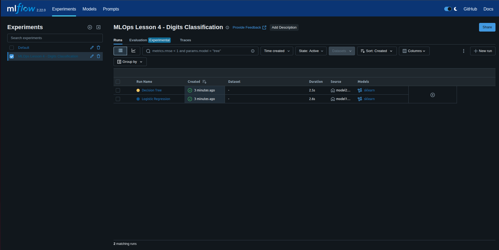
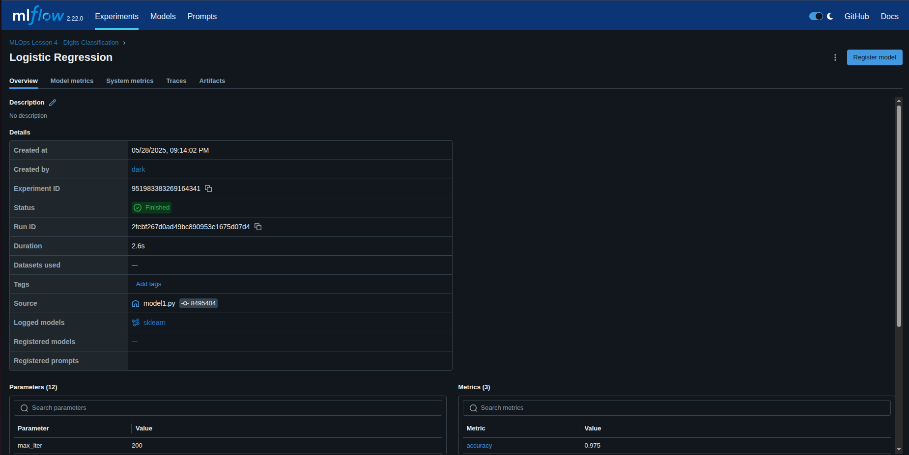
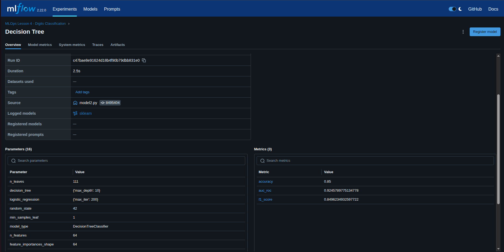
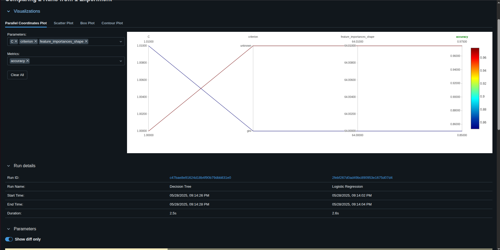

# MLOps Lesson 4 - Experiment Tracking with MLFlow

Этот проект демонстрирует использование MLFlow для трекинга экспериментов машинного обучения на классическом датасете "Digits".

## Описание

Проект содержит реализацию двух моделей машинного обучения:
1. **Логистическая регрессия** (`model1.py`)
2. **Решающее дерево** (`model2.py`)

Обе модели обучаются на датасете рукописных цифр (sklearn.datasets.load_digits) и используют MLFlow для логирования параметров, метрик и артефактов.

## Структура проекта

- `config.py` - конфигурационные параметры моделей
- `data.py` - загрузка и подготовка данных
- `model1.py` - логистическая регрессия с MLFlow трекингом
- `model2.py` - решающее дерево с MLFlow трекингом
- `requirements.txt` - зависимости проекта

## Отслеживаемые параметры

### Логистическая регрессия
- Коэффициенты регрессии (количество признаков, классов)
- Параметры регуляризации (C, penalty)
- Максимальное количество итераций
- Solver и другие гиперпараметры

### Решающее дерево
- Глубина дерева (max_depth)
- Количество листьев (n_leaves)
- Критерии разделения (criterion)
- Минимальное количество образцов для разделения
- Важность признаков

## Отслеживаемые метрики

Для обеих моделей логируются следующие метрики качества:
- **Точность (Accuracy)** - доля правильных предсказаний
- **F1 Score** - гармоническое среднее precision и recall
- **AUC-ROC** - площадь под ROC-кривой
- **Матрица ошибок (Confusion Matrix)** - сохраняется как артефакт

## Установка и запуск

1. Установите зависимости:
```bash
pip install -r requirements.txt
```

2. Запустите локальный MLFlow сервер:
```bash
mlflow server --host 127.0.0.1 --port 8080
```

3. Запустите эксперименты (в новом терминале):
```bash
python3 model1.py  # Логистическая регрессия
python3 model2.py  # Решающее дерево
```

4. Откройте MLFlow UI в браузере:
```
http://127.0.0.1:8080
```

## MLFlow Эксперименты

Все эксперименты логируются в эксперимент "MLOps Lesson 4 - Digits Classification" в MLFlow.

### Ссылки на эксперименты:

- **Эксперимент**: http://127.0.0.1:8080/#/experiments/951983383269164341
- **Логистическая регрессия**: http://127.0.0.1:8080/#/experiments/951983383269164341/runs/2febf267d0ad49bc890953e1675d07d4
- **Решающее дерево**: http://127.0.0.1:8080/#/experiments/951983383269164341/runs/c47bae8e91624d18b4f90b79dbb831e0

### Результаты экспериментов:

**Логистическая регрессия:**
- Accuracy: 0.975 (97.5%)
- F1 Score: 0.975
- AUC-ROC: 0.999

**Решающее дерево:**
- Accuracy: 0.85 (85.0%)
- F1 Score: 0.850
- AUC-ROC: 0.925

## Скриншоты MLFlow UI

### Общий вид экспериментов


### Детали эксперимента с логистической регрессией


### Детали эксперимента с решающим деревом


### Сравнение моделей


## Особенности MLFlow интеграции

1. **Автоматическое логирование моделей** - модели сохраняются в MLFlow Model Registry
2. **Артефакты** - confusion matrix сохраняются как PNG файлы
3. **Параметры** - все гиперпараметры и характеристики моделей логируются
4. **Метрики** - все метрики качества отслеживаются
5. **Локальный сервер** - эксперименты доступны через веб-интерфейс

## Сравнение моделей

В MLFlow UI вы можете:
- Сравнить метрики обеих моделей
- Просмотреть параметры и артефакты
- Загрузить сохраненные модели для инференса
- Анализировать confusion matrix для каждой модели

**Выводы:**
- Логистическая регрессия показала лучшие результаты по всем метрикам
- Решающее дерево имеет более низкую точность, но все еще показывает хорошие результаты
- Обе модели демонстрируют высокое качество классификации цифр
- MLFlow обеспечивает полную прослеживаемость экспериментов и возможность воспроизведения результатов

## Дополнительные эксперименты

Вы можете провести дополнительные эксперименты, изменив параметры в `config.py`:
- Увеличить/уменьшить глубину дерева
- Изменить параметры регуляризации для логистической регрессии
- Добавить новые модели или метрики